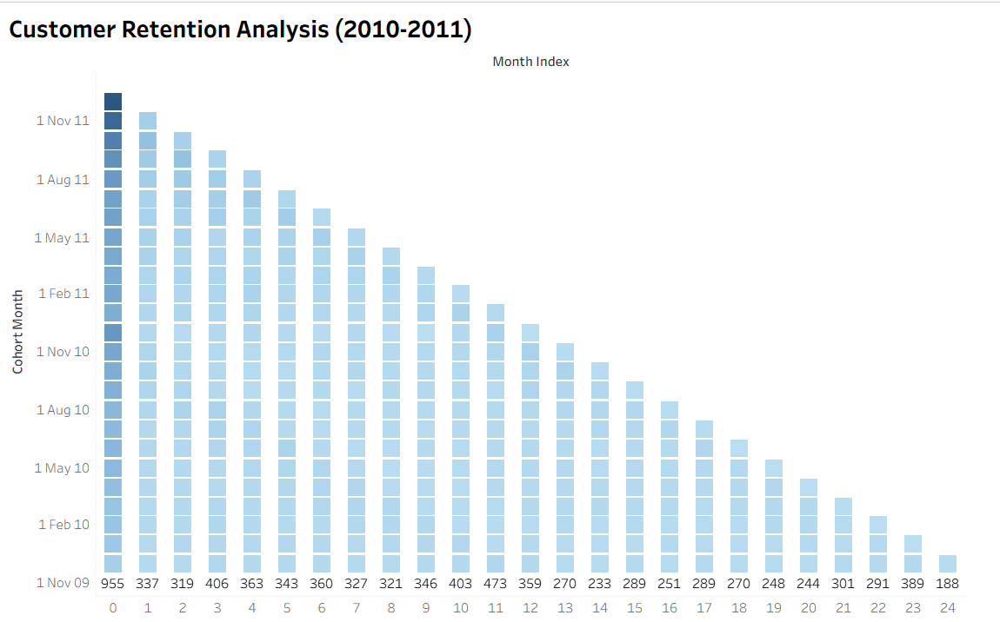
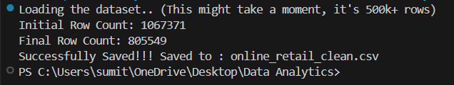
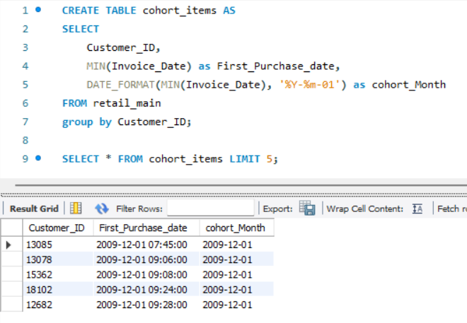
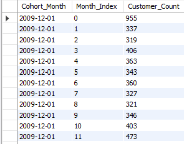

# E-Commerce Customer Retention & Cohort Analysis 📉

### 📌 Project Overview
I built this project to analyze customer retention for a UK-based online retailer using a dataset of **500,000+ transactions** (2010-2011). My goal was to understand how many customers stick around after their first purchase and identify where the biggest "churn" happens.

I built an automated pipeline using **Python** to clean the data and **SQL** to perform the complex cohort analysis, finally visualizing the results in a **Tableau** heatmap.

**🔴 Live Dashboard:** [Click here to view my Tableau Dashboard](https://public.tableau.com/views/CustomerRetentionAnalysis_17686679676030/Sheet1?:language=en-US&publish=yes&:sid=&:redirect=auth&:display_count=n&:origin=viz_share_link)

---

### 🛠️ My Technical Approach
I treated this like a real-world Data Analyst task, following a 3-step pipeline:

**1. Data Cleaning (Python & Pandas)**
* The raw data had missing values and text-based dates that SQL couldn't read.
* I wrote a Python script to clean the dataset and standardize the column names.
* I automated the loading process into MySQL using `SQLAlchemy`.

**2. The Analysis Logic (MySQL)**
* **Cohort Generation:** I used `MIN()` window functions to find the specific month each customer joined (their "Birth Month").
* **Retention Calculation:** I performed a `Self-Join` to compare the *Cohort Month* vs. the *Transaction Month*. This allowed me to calculate the exact time gap (in months) for every purchase.

**3. Visualization (Tableau)**
* I built a Retention Heatmap to make the drop-off rates easy to spot for non-technical stakeholders.

---

### 📸 Project Visuals

#### 1. The Final Dashboard
*Visualizing the churn pattern: 35% drop-off observed in Month 1.*

  

#### 2. Python ETL Results
*Successfully processed and loaded 800k+ rows into the database.*

  

#### 3. Defining the Cohorts (SQL)
*Identifying the "First Purchase Month" for every customer.*

  

#### 4. Calculating the Retention Matrix (SQL)
*This is the core logic: comparing the Join Date vs. Purchase Date to find the "Month Index".*

  

---

### 💡 What I Learned (Key Insights)
* **The "Month 1" Drop:** The biggest churn happens immediately. Only about **20-30%** of customers come back for a second purchase in the month after joining.
* **Seasonality:** Customers who joined in December (Holiday season) seemed to have slightly better long-term retention than those who joined in mid-year.
* **Business Value:** If I were presenting this to a manager, I would recommend a targeted email campaign at the **30-day mark** to try and fix that steep drop-off.
